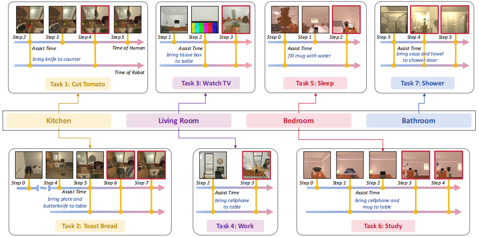

# Assistance Without Interruption: A Benchmark and LLM-based Framework for Non-Intrusive Human–Robot Assistance (NIABench)
[](https://arxiv.org/abs/2605.01368)

Official implementation of the paper "[Assistance Without Interruption: A Benchmark and LLM-based Framework for Non-Intrusive Human–Robot Assistance](https://arxiv.org/abs/2605.01368)".

Authors: Yuedi Zhang, [Shuanghao Bai](https://baishuanghao.github.io/), [Wanqi Zhou](https://ellezwq.github.io/), Haoran Zhang, Qi Zhang, [Zhirong Luan](https://scholar.google.com/citations?user=mJNCeucAAAAJ&hl=zh-CN), [Badong Chen](https://scholar.google.com/citations?user=mq6tPX4AAAAJ&hl=zh-CN&oi=ao).

<hr />

## 🎉 Highlights

<div align="center">
  
</div>

> **<p align="justify"> Abstract:** *Human–robot interaction (HRI) has long studied how agents and people coordinate to achieve shared goals. In this work, we formalize and benchmark the non-intrusive assistance as an independent paradigm of HRI, where a robot proactively supports a human’s ongoing multi-step activities while strictly avoiding interruptions. Unlike conventional HRI tasks that rely on direct commands, explicit negotiation, or proactive interventions based on user habits and history, our task treats the human’s plan as the primary process and formulates assistance as a joint decision over when to act and what to do. To systematically evaluate this problem, we establish a simulation benchmark, NIABench, along with new metrics tailored to the non-intrusive assistance task. We further propose a hybrid architecture that integrates an LLM with a scoring model. The scoring model first applies semantic retrieval to prune large candidate action sets, and then a ranker evaluates human-step and robot-action pairs, enabling reasoning over timing and cross-step dependencies. Comprehensive experiments on both NIABench and real-world scenarios demonstrate that our method achieves proactive, non-intrusive assistance that reduces human effort while preserving task effectiveness.* </p>

<details>

<summary>Main Contributions</summary>

1) We formalize the non-intrusive assistance task in HRI, which focuses on supporting humans without disrupting their ongoing actions. To facilitate evaluation, we develop a corresponding simulation benchmark, NIABench, along with tailored metrics.

2) We propose a simple yet effective approach that integrates semantic retrieval with joint scoring to efficiently and accurately identify non-intrusive assistance.

3) We conduct comprehensive empirical evaluations on both NIABench and real-world settings, demonstrating that our method can substantially reduce human effort without intervention and improve decision quality without compromising task success.

</details>

<hr />

## 🛠️ Installation

For installation and other package requirements, please follow the instructions as follows. 
This codebase is tested on Ubuntu 20.04 LTS with python 3.8. Follow the below steps to create environment and install dependencies.

* Setup conda environment.
```bash
conda create -n niabench python=3.8
conda activate niabench
conda install pytorch==2.0.0 torchvision==0.15.0 torchaudio==2.0.0 pytorch-cuda=11.8 -c pytorch -c nvidia
```

* Clone DPSPG code repository and install requirements.
```bash
# Clone NIABench code base
git clone https://github.com/renytek13/NIABench.git
cd NIABench

# Install requirements
pip install -r requirements.txt
```

## 📈 Training and Reasoning

We provide the running scripts in `scripts`, which allow you to produce correct tasks.

To obtain correct robot tasks, please run the bash file in [scripts folder](scripts) as follows:
```bash
# Example: trains in cut_tomato scene. 
bash scripts/train.sh
```

## 🚀 Running Simulation Tasks

We provide the running scripts in `scripts`, which allow you to reproduce simulation tasks and obtain videos.

Please run the bash file in [scripts folder](scripts) as follows:
```bash
# Example: trains in cut_tomato scene. 
bash scripts/simulation.sh cut_tomato
```

## 📨 Contact

If you have any questions, please create an issue on this repository or contact us at zyd993@stu.xjtu.edu.cn.


## 🙏 Acknowledgements

Our code is based on [AI2-THOR](https://github.com/allenai/ai2thor) repository. We thank the authors for releasing their codes. If you use their codes, please consider citing these works as well. 